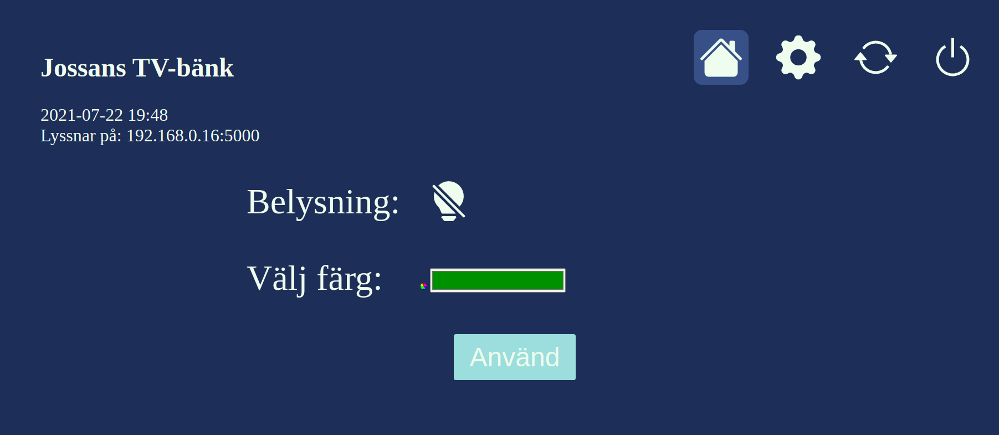
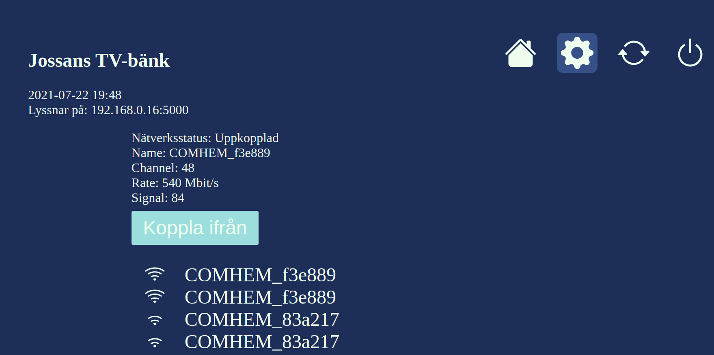

# Jossans TV-bench

This is a smart TV-bench made out of old balcony floor decking!
It has a robust cool look, some awesome lighting and of course a raspberry pi
hooked up to a touch display, running a server so you can easly adjust the lighting
either from the bench, or from your phone/laptop!

The RPi is fully automatic and fetches this repo on boot to look for new
updates to the firmware.

Python libraries used:
- [flask](https://flask.palletsprojects.com/en/2.0.x/) - For the webserver.
- [rpi_ws281x](https://github.com/jgarff/rpi_ws281x) - For controlling led strip.

The RPi runs in kiosk-mode and uses `chromium-browser` to render the webpage.
I mainly followed this [awesome guide](https://pimylifeup.com/raspberry-pi-kiosk/)
to get it up and running.

---

### Home page

### Settings page
